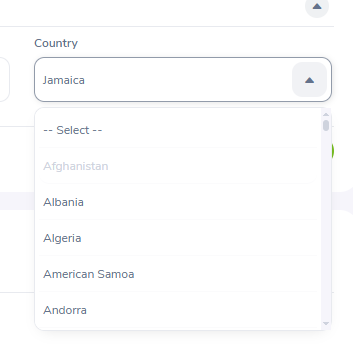

# Bug reports — OrangeHRM Demo

---

## BUG-001 — Campos de seleção em todos os formulários não filtram opções ao digitar letra inicial

| Campo | Detalhe |
|---|---|
| **ID** | BUG-001 |
| **Data** | 15/06/2026 |
| **Módulo** | Global — Formulários (Admin, PIM, Recruitment) |
| **Severidade** | Medium |
| **Prioridade** | Medium |
| **Tipo** | Usabilidade |
| **Status** | Aberto |

### Ambiente
Microsoft Edge · Windows · https://opensource-demo.orangehrmlive.com

### Pré-condição
Usuário logado como Admin. Qualquer formulário do sistema que contenha campos de seleção (dropdowns).

### Passos para reproduzir

1. Acessar qualquer módulo com formulário (ex: PIM → Employee List → Personal Details)
2. Clicar em um campo de seleção (ex: Country, Nationality)
3. Digitar uma letra (ex: "B")
4. Observar o comportamento da lista de opções
5. Repetir em outros módulos (Admin, Recruitment) para confirmar o comportamento

### Resultado esperado
A lista filtra e exibe apenas as opções que correspondem à letra digitada, facilitando a seleção.

### Resultado obtido
A lista abre exibindo todas as opções sem filtrar pelo caractere digitado. O usuário é obrigado a rolar manualmente por toda a lista para encontrar o item desejado. Comportamento confirmado nos módulos Admin, PIM e Recruitment.

### Observação adicional
Mesmo quando um valor já está selecionado no campo (ex: "Jamaica"), ao abrir a lista o sistema posiciona no topo em vez de destacar o item atualmente selecionado. O usuário perde a referência de onde está na lista.

### Impacto
Problema sistêmico que afeta todos os campos de seleção do sistema. Prejudica a eficiência do usuário especialmente em listas longas como países e nacionalidades, impactando os módulos Admin, PIM e Recruitment.

### Evidência

> Campo "Country" com valor "Jamaica" selecionado. Ao abrir a lista, todos os países são exibidos a partir do topo (Afghanistan, Albania, Algeria...) sem posicionar no item atual e sem filtrar por inicial digitada.

---

*Voltar para o projeto: [README.md](./README.md)*
